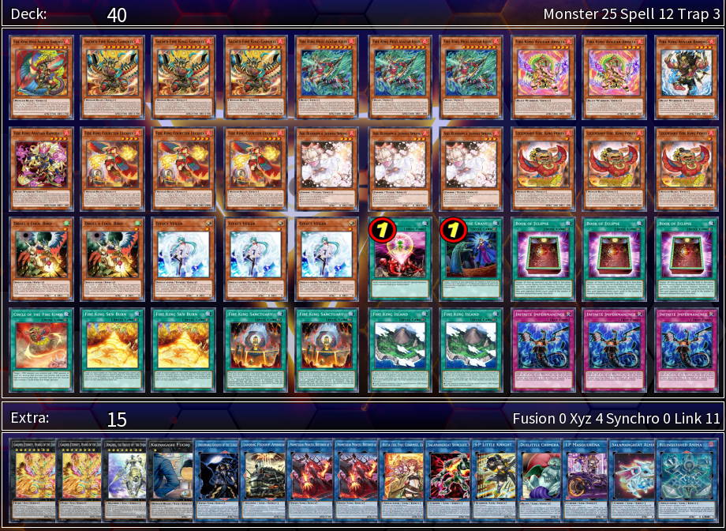

# Sample Decklist

### Main Deck
**Monsters**
* 1x [_Fire King High Avatar Garunix_]
* 3x [_Sacred Fire King Garunix_]
* 3x [_Fire King High Avatar Kirin_]
* 2x [_Fire King Avatar Arvata_]
* 1x [_Fire King Avatar Barong_]
* 1x [_Fire King Avatar Rangbali_]
* 3x [_Fire King Courtier Ulcanix_]
* 3x [_Ash Blossom & Joyous Spring_]
* 3x [_Legendary Fire King Ponix_]
* 2x [_Droll & Lock Bird_]
* 3x [_Effect Veiler_]

**Spells / Traps**
* 1x [_One for One_]
* 1x [_Pot of Prosperity_]
* 1x [_Called by the Grave_]
* 1x [_Circle of the Fire Kings_]
* 1x [_Fire King Sky Burn_]
* 3x [_Fire King Sanctuary_]
* 3x [_Fire King Island_]
* 3x [_Infinite Impermanence_]

### Extra Deck
**Xyz Monsters**
* 2x [_Garunix Eternity, Hyang of the Fire Kings_]
* 1x [_Dingirsu, the Orcust of the Evening Star_]
* 1x [_Kikinagashi Fucho_]

**Link Monsters**
* 1x [_Amphibious Swarmship Amblowhale_]
* 2x [_Promethean Princess, Bestower of Flames_]
* 1x [_Dharc the Dark Charmer, Gloomy_]
* 1x [_Hiita the Fire Charmer, Ablaze_]
* 1x [_Salamangreat Sunlight Wolf_]
* 1x [_S:P Little Knight_]
* 1x [_Duelittle Chimera_]
* 1x [_I:P Masquerena_]
* 1x [_Salamangreat Almiraj_]
* 1x [_Relinquished Anima_]

{{#include ../links.md}}
