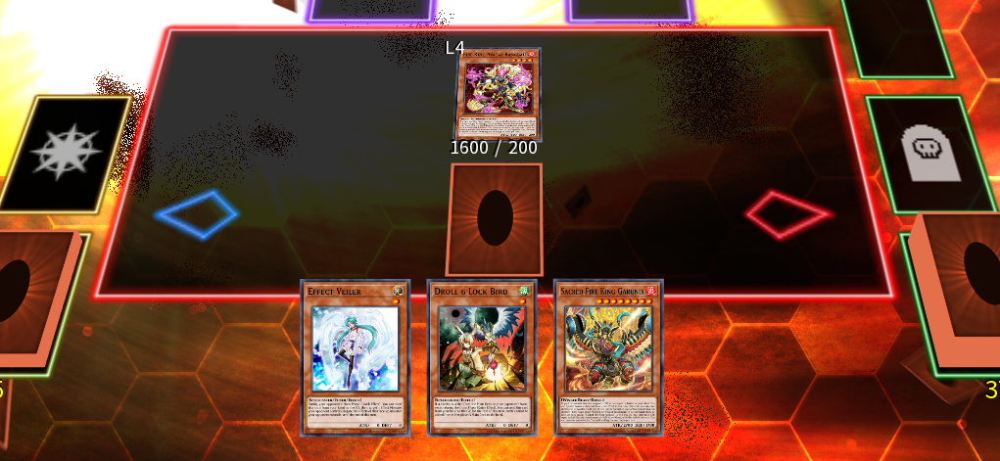

# Using Sacred as a handtrap

[_Sacred Fire King Garunix_] gives you countless opportunities for interaction when you plan around the fact it can Special Summon itself from both your hand and your GY.

Let's take this opening hand as an example:

- [_Effect Veiler_]
- [_Fire King Avatar Rangbali_]
- [_Droll & Lock Bird_]
- [_Sacred Fire King Garunix_]
- [_Fire King Sky Burn_]

Looking at it from a combo perspective, this hand is disastrous, as we cannot perform any of the combos we showcased in this guide. However, we can still put up an interactive endboard, provided we use our cards wisely.

Let's play this out:
- Normal Summon [_Fire King Avatar Rangbali_].
- Set [_Fire King Sky Burn_].
- Pass turn.

Your opponent might think it's kind of pathetic, but in reality we have at least 5 interruptions set up:

- Rangbali can negate a Spell effect, destroying Sacred from hand.
- Sky Burn can pop Rangbali and your opponent's monster.
- Sacred can trigger from hand or GY, when Rangbali gets destroyed.
    - Sacred then can destroy [_Fire King High Avatar Kirin_], reviving Rangbali and destroying a card.
- Veiler can negate a monster.
- Droll can stop your opponent from searching more cards.

With any luck, this can be enough to ruin your opponent's turn, giving you a chance to take over the game depending on what you draw.

{{#include ../links.md}}
