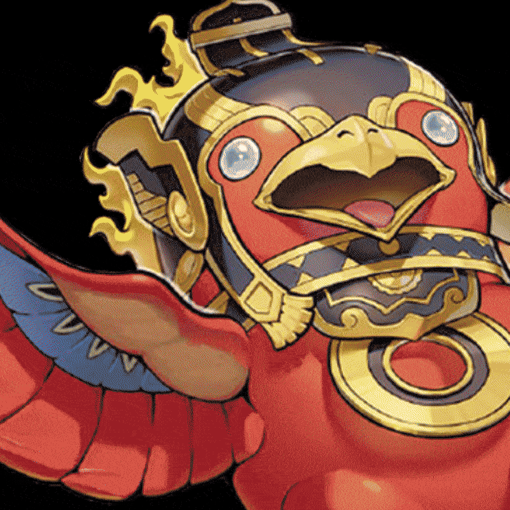

# Welcome!

This guide aims to be a comprehensive resource for anyone who wants to learn to play a Fire King deck; whether you are a casual Yu-Gi-Oh! player or a seasoned competitive veteran looking to learn a new deck, we hope this book proves useful to you.

As of today, we feature all the combos the archetype can perform using [Dinh-Kha Bui's French Open 2025 winning list](https://ygoprodeck.com/deck/fire-king-591564).

With time, we aim to expand past that, adding combos for different Fire King builds, strategies for playing through your opponent's interaction, and executing on the deck's win condition either going first or going second.

That said, keep in mind that Fire King is a midrange deck - as such, a lot of the decisions you make depend on your opening hand, matchup and how your opponent responds to your actions. Memorizing combos and play patterns is useful, but you will get a sense of which paths to take only by actively playing the deck. Practice makes perfect!

We hope you have fun learning the deck - let's dive right in!

 

> This book assumes you already know how to play _Yu-Gi-Oh!_ at a basic level. We'll try to explain more advanced concepts where applicable, but beginners should expect to Google some things here and there.
>
> Additionally, note that this guide focuses on the **_Yu-Gi-Oh!_ TCG**. While most of it will apply for the _Yu-Gi-Oh!_ OCG as well, there will be some details that differ between the two formats.