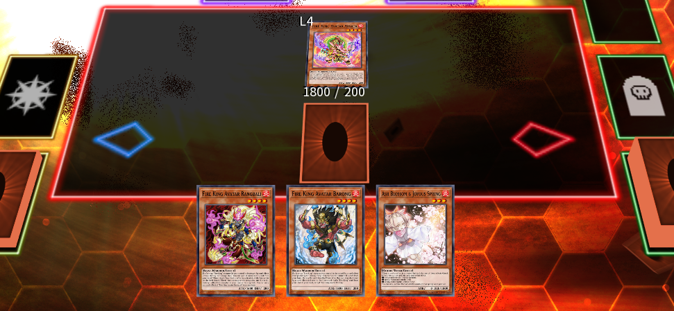

# Avatars working together

Let's look at another funny hand:

- [_Fire King Avatar Rangbali_]
- [_Fire King Avatar Arvata_]
- [_Fire King Avatar Barong_]
- [_Called by the Grave_]
- [_Ash Blossom & Joyous Spring_]

Once again, no chance of getting the usual combos going, but we are also not planning on just passing. Let's play this out:

- Normal Summon [_Fire King Avatar Arvata_].
- Set [_Called by the Grave_].
- Pass turn.

> If you're running Called by the Grave, remember it doesn't have to be used against handtraps only, you can also disrupt your opponent's GY effects or anything that targets cards in the GY.

As before, it's a pretty unassuming board if you're the opponent, but it does pack a punch.

First off, the obvious interruptions:
- Arvata can negate a monster effect, destroying Barong.
- Called By can disrupt any effect that activates in the GY or that targets cards in the GY.
- Ash Blossom can negate an effect that messes with the Main Deck.

Additionally, when Arvata destroys Barong, Rangbali's effect can be triggered, giving you the option to Special Summon it from the hand. That gives you an additional Spell/Trap negate, destroying Arvata.

When Arvata is destroyed, it can bring back Barong to keep up your defenses until the End Phase. If Barong gets destroyed, either by your opponent, or during the End Phase as per Arvata's effect, it gives you access to [_Legendary Fire King Ponix_] in the Standby Phase, enabling you to fight back right away.

> Be aware of the Avatars' effects and use them to your advantage whenever possible. It's common to forget that Barong and Rangbali (and Ponix!) have this effect that Special Summons them from the hand if another Fire King is destroyed.

{{#include ../../links.md}}